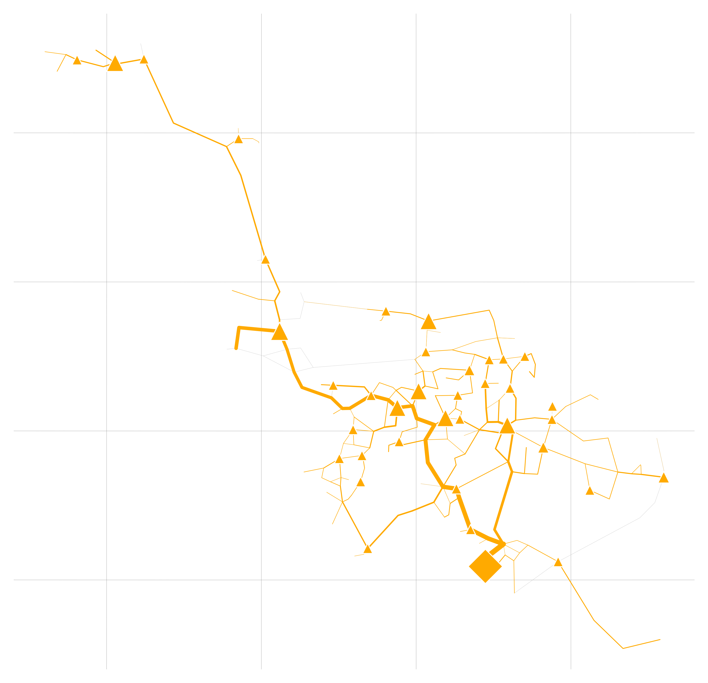
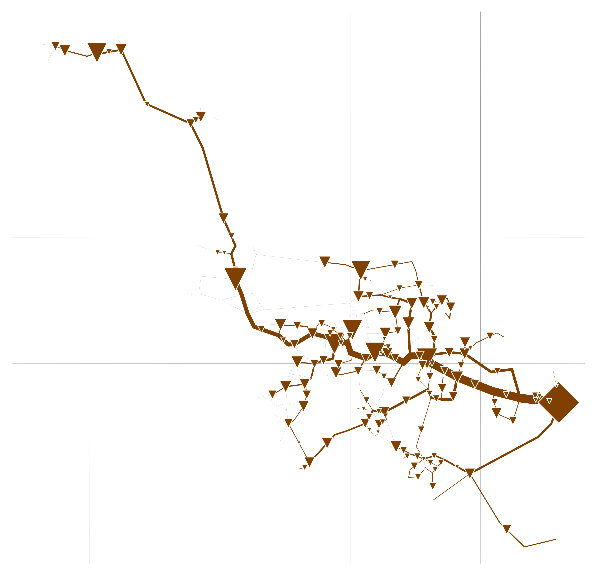

# rivus

rivus is a [mixed integer linear programming](https://en.wikipedia.org/wiki/Integer_programming) optimisation model for capacity planning for energy infrastructure networks. Its name, latin for stream or canal, stems from its origin as a companion model for [urbs](https://github.com/tum-ens/urbs), an optimisation model for urban energy systems. This model shares the same structure as urbs, so please refer to its introduction/tutorial for now or dive directly into the code.  

## Features

  * rivus is a mixed integer linear programming model for multi-commodity energy infrastructure networks systems with a focus on high spatial resolution.
  * It finds the minimum cost energy infrastructure networks to satisfy a given energy distribution for possibly multiple commodities (e.g. electricity, heating, cooling, ...).
  * Time is represented by a (small) set of weighted time steps that represent peak or typical loads  
  * Spatial data can be provided in form of shapefiles, while technical parameters can be edited in a spreadsheet.
  * The model itself is written using [Pyomo](https://software.sandia.gov/trac/coopr/wiki/Pyomo) and includes reporting and plotting functionality. 

## Screenshots

<a href="doc/img/caps-elec.png"></a>
<a href="doc/img/caps-heat.png"></a>
<a href="doc/img/caps-gas.png"></a>

## Installation

### Windows

> :information_source: **Note** Steps 1 to 3 are identical to the installation of [urbs](https://github.com/tum-ens/urbs). In case you already have that model installed, they can be skipped.

1. [**Anaconda (Python 3.5)**](http://continuum.io/downloads). Choose the 64-bit installer if possible.
2. [**GLPK**](http://winglpk.sourceforge.net/).  (thanks to a [bug in pyomo](https://software.sandia.gov/trac/pyomo/ticket/4641), only version 4.57 or older is supported at the moment [September 2016])
   1. Simply unzip the downloaded version to a folder, e.g. `C:\GLPK`. 
   1. Then add the subdirectory `w64`, which contains `glpsol.exe`, to the system path ([how](http://geekswithblogs.net/renso/archive/2009/10/21/how-to-set-the-windows-path-in-windows-7.aspx)), so that the `glpsol` command is available on the command prompt.
3. **Pyomo**
   1. Launch a new command prompt (Win+R, type "cmd", Enter)
   2. Type `pip install pyomo`, hit Enter.

4. Add **shapefile support**:
   ```
   conda install -c conda-forge pyshp shapely basemap
   ```

5. Get **dependencies for geopandas**:
   ```
   conda install -c conda-forge pyproj fiona geopy
   ```

6. Get **geopandas** itself:
   ```
   pip install geopandas
   ```
   
7. Some custom Python helper functions (*to be included in rivus*):
   1. Launch a new command prompt (Win+R, type "cmd", Enter)
   2. Start a python interactive session by starting `python`. Within, execute the following commands:

        ```python
        import os, site
        os.makedirs(site.USER_SITE)
        os.chdir(site.USER_SITE)
        os.system('git clone https://github.com/ojdo/python-tools.git .')
        ```

> :information_source: **Note** Steps 5 and 6 can be merged to `conda install -c conda-forge geopandas` once [issue #9 in geopandas-feedstock](https://github.com/conda-forge/geopandas-feedstock/issues/9) is resolved.


## Copyright

Copyright (C) 2015-2016  Johannes Dorfner

This program is free software: you can redistribute it and/or modify
it under the terms of the GNU General Public License as published by
the Free Software Foundation, either version 3 of the License, or
(at your option) any later version.

This program is distributed in the hope that it will be useful,
but WITHOUT ANY WARRANTY; without even the implied warranty of
MERCHANTABILITY or FITNESS FOR A PARTICULAR PURPOSE.  See the
GNU General Public License for more details.

You should have received a copy of the GNU General Public License
along with this program.  If not, see <http://www.gnu.org/licenses/>
