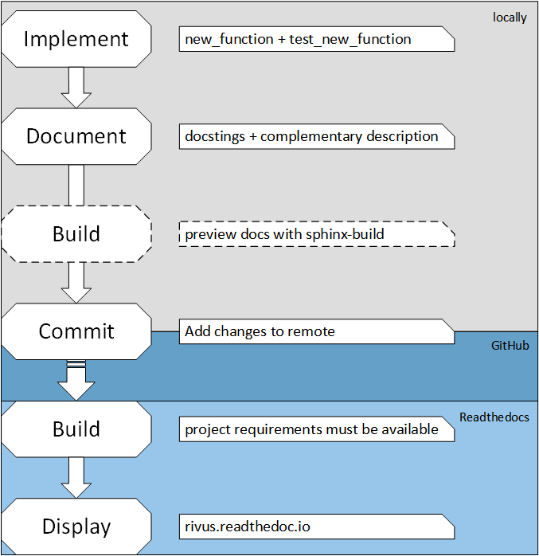

#############
Contribution
#############

***********
Code Style
***********

Naming conversions
===================

Still not written in stone but the ``snake_case`` seems to dominate the code base.
If you are new to the project, take up that one.

Most importantly, use descriptive names and stick to one style and use it consequently.

Regarding functions, variables, class etc. we follow the good advice of PEP8_.

.. note::
  Functions: Please use an underscore like ``_spam_and_helps()`` for functions which should not be used outside of the sub-package (package). |br| Start function names without an underscore if they are meant to be used outside of the package/sub-package. E. g. ``flying_circus()``.

For the rest, it is still to be defined. But we basically follow PEP8_,  but do not forget how PEP8_ itself starts:

  *"A Foolish Consistency is the Hobgoblin of Little Minds"*
 
So use it when it makes sense, and do not where it does not.
We would even suggest looking for an auto-pep8 plug-in for your favourite IDE or text editor.
Or go bare bones and get something like flake8_ to check your code.
If it is too annoying, you can always add some guidelines to be ignored.
But at the and of the day, it will help you and us to read the code.

.. todo::
  Look into ``rivus.main.rivus`` and reformat code where it makes sense.
  (Mathematical notation vs. descriptiveness)

.. _PEP8: http://legacy.python.org/dev/peps/pep-0008/
.. _flake8: http://flake8.pycqa.org/en/latest/

**********
Unittests
**********

.. note::

  Unit tests are criteria for pull-request acceptance.

As several bugs could have been avoided with unit tests, we want to embrace testing
in the development workflow.

You can find and extend the tests in :file:`rivus-repo/rivus/tests/test_*.py`
Just add your own test_subpackage.py and start with the following skeleton:

.. code-block:: python

  import unittest
  # import what you want to test with an absolute path.
  # If I want to test line_length from main.rivus:
  from rivus.main.rivus import line_length

  # give a nice class name.
  class RivusMainTest(unittest.TestCase):

    def test_line_length(self):
      # here comes the test logic
      # self.assertTrue(4/2 == 4//2, msg='What? Is not that always true???')
      pass

To run all tests:
::

  >>> cd /to/rivus/repo/
  >>> python -m unittest
  ----------------------------------------------------------------------
  Ran 10 tests in 4.572s

  OK

To run specific test(s):
::

  >>> cd /to/rivus/repo/
  >>> python -m unittest rivus.tests.test_db
  ----------------------------------------------------------------------
  Ran 1 test in 1.213s

  OK

**********
Profiling
**********

Although the whole project is not yet in a performance oriented phase, 
it can be very helpful in the long run if more and more profiling is involved 
within the contributions.

For decision between short expression: use :code:`timeit.timeit()`.
E.g. is ``.at[]`` or ``.loc[]`` indexer slower from a DataFrame?
::
  
  >>> import timeit.timeit as tit
  >>> dfout = m.r_out.to_frame()  # m is a rivus problem instance
  >>> tit("m.r_out.loc['Gas power plant', 'CO2']", number=1000, globals=dict(m=m))
  >>> tit("dfout.at[('Gas power plant', 'CO2'), 'ratio']", number=1000, globals=dict(dfout=dfout))

To detect overall (function-level) hotspots (where the most time is spent)
you can use cProfile with pstats.
See `blog post <http://stefaanlippens.net/python_profiling_with_pstats_interactive_mode/>`_
::

  python -m cProfile -o runme.profile runme.py  # Execute with profiler
  python -m pstats runme.profile  # Interactive analyser
  % sort cumulative
  % stats 10

To go deeper, you can use the jupyter magic, %lprun (line_profiler). 
See `end of tutorial <http://nbviewer.jupyter.org/gist/jiffyclub/3062428>`_
and `other <http://mortada.net/easily-profile-python-code-in-jupyter.html>`_
::
  
  %load_ext line_profiler
  %lprun -f slow_functions.main slow_functions.main()

.. note::

  Profiling is encouraged before pull-request.

**************
Documentation
**************

Nobody can explain better what your code does than you.
The doc-strings are essential, and I would not suppose anybody
would submit code without it ;)

Please take the time and jump into the conventions of :abbr:`RtD (Readthedocs)`
the following short description should be enough to get you started and ensure the success of your contribution.

.. note::

  We use nepoleon_ (autodoc_) extensions to parse the doc-strings.
  You can decide whether you choose NumPy or Google style.

  Google it, there is a good chance that there is already a plug-in for your 
  favourite IDE or text editor. (Yes, there is even one for vim...)

  The whole RtD (Sphinx) workflow builds on :abbr:`rST (reStructuredText)`.
  So format your Examples, Notes, References in the doc-strings also
  with rST syntax.

  Doc-string template:
  ::

    """Summary line.

    Extended description of function.

    Parameters
    ----------
    arg1 : int
        Description of arg1
    arg2 : str
        Description of arg2

    Returns
    -------
    bool
        Description of return value

    Example
    --------
    ::

      this_will = 'be formatted as nice code!'

    Note
    ----
    + This is a bullet list
    + E.g. for limitations...

    .. note::

      This will draw attention to the content.

    .. warning::

      This is for deprecate warnings and such. 
    """

.. note::
  For autodoc/napoleon to work, readthedocs must be able to build the whole
  project. It will create a new environment and install the packages from
  environment.yml. This is told to readthedocs through the ``readthedocs.yaml`` config file.
  See :ref:`project structure <a_readyaml>`

The whole process of the documentation is depicted in the following figure.

  How to write docs. Dashed: suggested optional step. After commit, 
  the rest should be done automatically.

How to write (and build) documentation locally:

+ `Install Sphinx <http://docs.readthedocs.io/en/latest/getting_started.html>`_
  ::

    pip install sphinx sphinx-autodoc

+ `Install RtD local theme <https://github.com/rtfd/sphinx_rtd_theme#id2>`_
  ::

    pip install sphinx_rtd_theme    

+ Build the docs manually into doc/_build/html/
  ::

    cd /rivus/repo/doc
    make html

+ Or start autobuild, which will detect changes and autobuild the new html.
  ::

    cd /rivus/repo
    sphinx-autobuild doc/ doc/_build/html

Tips:

+ `online table editor <http://truben.no/table/>`_
+ `online pandoc converter <https://pandoc.org/try/>`_
  It is an anything to anything converter. Here: (HTML, Markdown, ...) -> rST
+ `online rST/Sphinx editor <https://livesphinx.herokuapp.com/>`_
+ You can also try Atom and its rST packages.

.. note::

  Documentation is a criteria for pull-request acceptance.

.. _nepoleon: http://www.sphinx-doc.org/en/stable/ext/napoleon.html
.. _autodoc: http://www.sphinx-doc.org/en/stable/ext/autodoc.html

**************
Doc TODOs
**************
Summary of the ToDos from the *whole* documentation.

.. todolist::
