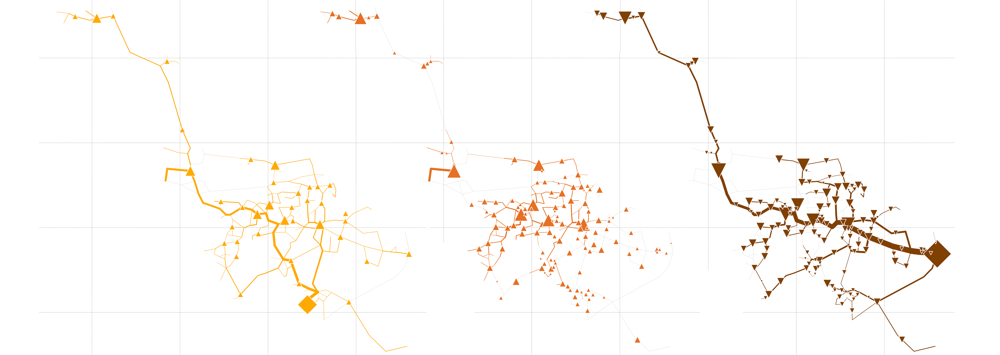

####################################################################################
rivus: A mixed integer linear optimisation model for energy infrastructure networks
####################################################################################

:Maintainer: Johannes Dorfner, <johannes.dorfner@tum.de>
:Organization: `Chair of Renewable and Sustainable Energy Systems`_,
               Technical University of Munich
:Version: |version|
:Date: |today|
:Copyright:
  This documentation is licensed under a `Creative Commons Attribution 4.0
  International`__ license.

.. __: http://creativecommons.org/licenses/by/4.0/

.. toctree::
   :maxdepth: 3

   intro
   overview
   reference_data
   reference_subs
   reference_math
   contribution

***********************
Short Introduction
***********************

* rivus_  is a :abbr:`MILP (mixed integer linear programming)` model for multi-commodity
  energy infrastructure networks systems with a focus on high spatial
  resolution.
* It finds the minimum cost energy infrastructure networks to satisfy a given
  energy distribution for possibly multiple commodities (e.g. electricity,
  heating, cooling, ...).
* Time is represented by a (small) set of weighted time steps that represent
  peak or typical loads
* Spatial data can be provided in form of shapefiles, while technical
  parameters can be edited in a spreadsheet.
* Sister project to `urbs`_ which has a focus on high time resolution analysis.

************
Demo Output
************
Besides the numerical results (obtainable programmatically or as an excel report),
rivus is can visualize the results.
You can see a unified figure of the typical result plots bellow created by
:func:`rivus.main.rivus.result_figures`, which in turn is a wrapper around
:func:`rivus.main.rivus.plot`.
Merge was done only for better spacing in the documentation.

Unified rivus capacity output of a smaller city.

Yellow:
  Electricity network capacities

Red:
  Heat network capacities

Brown:
  Gas network capacities

Gray:
  Longitude and latitude guidelines.

Symbols:
  Diamond shapes represent energy sources.
  The width of the lines represent the amount of built capacity.
  Triangles represent energy conversion processes. Pointing upwards indicate generation,
  downwards indicates consumption of that commodity.

If got courious go to :ref:`Installation <a_install>`

***********************
Change-log
***********************

.. todo::
  Set version number to 0.2 after accepting the PRs

Version 0.2
============
* 2017-10
* Major bug-fix regarding line length calculation(`#13`_)
* Major bug-fic regarding usage of hubs in vertices (`#37`_)
* Restructuring (Issue5_, PR8_)
* 3D visualization for results (PR13_)
* Abstract street network generator (PR8_, PR28_)
* 3D interactive visualization for results (`#17`_)
* Graph/Network analysis sub package (`#22`_)
* PostgreSQL+PostGIS integration (`#24`_)
* Unittests (`#33`_)
* Line length calc bugfix
* Save function extension (`#16`_)
* Excel parsing (`#23`_)
* Speed-ups (`#27`_)
* Fix Warnings (`#30`_)

.. _`#17`: https://github.com/tum-ens/rivus/pull/17
.. _`#22`: https://github.com/tum-ens/rivus/pull/22
.. _`#24`: https://github.com/tum-ens/rivus/pull/24
.. _`#28`: https://github.com/tum-ens/rivus/pull/28
.. _`#33`: https://github.com/tum-ens/rivus/pull/33
.. _`#13`: https://github.com/tum-ens/rivus/pull/13
.. _`#16`: https://github.com/tum-ens/rivus/pull/16
.. _`#23`: https://github.com/tum-ens/rivus/pull/23
.. _`#27`: https://github.com/tum-ens/rivus/pull/27
.. _`#30`: https://github.com/tum-ens/rivus/pull/30
.. _`#37`: https://github.com/tum-ens/rivus/pull/37
.. _Issue5: https://github.com/tum-ens/rivus/issues/5
.. _PR8: https://github.com/tum-ens/rivus/pull/8
.. _PR13: https://github.com/tum-ens/rivus/pull/17
.. _PR28: https://github.com/tum-ens/rivus/pull/28

Version 0.1
============
* 2015-05
* Initial release.

*************
Dependencies
*************

* Python_ version 3.x is supported. Version 2.7 may work.
* Pyomo_ for model equations and as the interface to optimisation solvers
  (CPLEX, GLPK, Gurobi, ...). Version 4 recommended, as version 3 support
  (a.k.a. as coopr.pyomo) will be dropped soon.

  + ConcreteModel is the basis to formulate our optimisation problem.

* matplotlib_ for plotting
* Plotly_ for interactive 3D plots [extension]
  
  + We use the offline variants of this package.
  + Also compatible with the jupyter notebook.

* Pandas_ for input and result data handling, report generation
  
  + Pandas' DataFrame is used *very extensively* throughout rivus.

* SQLAlchemy_ and psycopg2_ for database integration [extension]

  + Pandas's DataFrame works together with SQLAlchemy.

* NetworkX_ for network analysis [extension]

.. _Python: https://www.python.org/
.. _Pyomo: http://www.pyomo.org/
.. _matplotlib: http://matplotlib.org
.. _Pandas: https://pandas.pydata.org
.. _Plotly: https://plot.ly/python/getting-started/
.. _SQLAlchemy: http://www.sqlalchemy.org/
.. _psycopg2: http://initd.org/psycopg/
.. _NetworkX: https://networkx.github.io/

.. _Chair of Renewable and Sustainable Energy Systems: http://www.ens.ei.tum.de/
.. _rivus: https://github.com/tum-ens/rivus
.. _urbs: https://github.com/tum-ens/urbs
