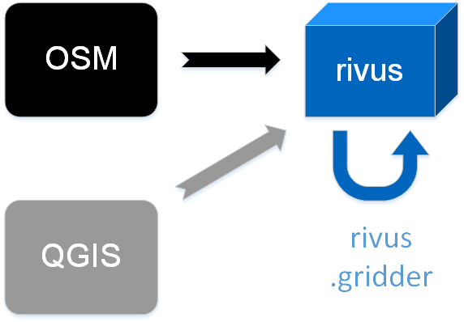
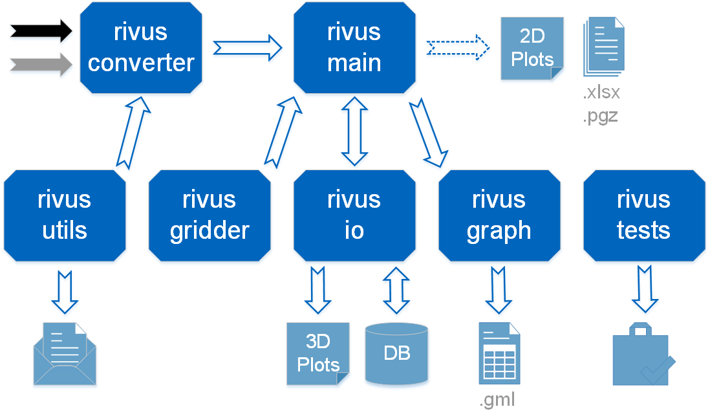

#########
Overview
#########

This section will:

* Get an understanding how ``rivus`` is built up and why.
* Introduce you to the sub packages and direct you to their documentation.
* Clarify what data is expected as input and what you can aspect as output.

.. _a_tutorial:

***********************
Data- and Work-Flows
***********************

Work-flows differ from each other mainly at the beginning. From where one gets
the input data.

Further differences can arise if one is interested in running a multitude of optimization problems.
Whatever the reason is (sensitivity analysis, structural analysis etc.) the same needs arise.
The file based output will not be sufficient
to manage and analyse the output effectively. And there is a good chance, that one
will move to a remote server to relieve the own computer.

The following section deals with the cases of different data sources.

Input Sources
==============

Most generally speaking, for working with ``rivus`` you will need the following inputs:

+ Non-spatial data in a specially formatted Excel spreadsheet.

  - See `Example <https://github.com/tum-ens/rivus/blob/master/data/mnl/data.xlsx>`_
  - Here you can input details about costs, capacities, available commodities etc.
  - Detailed description :ref:`here <a_spreadsheet>`

+ Spatial data

  - We have been using shapefiles but you can use any format which geopandas_ can read.
  - Shapefiles are a somewhat awkward file format, but you can find an included example 
    in `mnl <https://github.com/tum-ens/rivus/tree/master/data/mnl>`_.
  - We need an extended version of the files ``vertex`` and ``edge``
    which next to the geometrical information, hold additional demand or source columns.
    ``vertex`` holds information about the maximum available commodity in a source vertex.
    ``edge`` incorporates the accumulated demand per area (building) type and per edge (street).
    The demand's unit is |m2| as it represents the accumulated base area of different building types.
    This data preparation can be achieved in a run-script before model creation or with helpers
    manually in the data preparation process.
  - Detailed description: :ref:`vertex <a_vertex>`, :ref:`edge <a_edge>`

.. _geopandas: http://geopandas.org/io.html

.. _a_workflows:

  Import possibilities, with Open-source tools.

There are several possibilities to get the spatial input data for ``rivus``,
and conduct analysis on them.

1. Extract data from :abbr:`OSM (OpenStreetMap)` (e.g. with the help of MapZen_)

  - Extensive data preparation is needed for simplifying the geometrical structure
    of the vector layers. (*Currently, this workflow is under maintenance.*)
  - Example haag15_ illustrates an extended version of this method.

  .. note::

    Package OSMnx_ could be investigated, as it proposes a very convenient ``gdf_from_place`` function.
    (Although it fetches one polygon, the source could serve as a good example. 
    Alternatively, the whole shapefile phase could be skipped, with its :func:`ox.graph_from_place('Manhattan, New York, USA', network_type='drive')` function. And the :file:`edge` could be calculated
    from that source. There are even some possibilities to simplify the resulting graph,
    which could be an alternative to the current ``skeletron`` based approach.
    Furthermore, this package already solved the automated UTM code calculation
    so at least, that would be of great use for us.
    :: 

      >>> osmnx as ox
      >>> city = ox.gdf_from_place('Berkeley, CA')
      >>> city_xy = os.project_gdf(city)
      >>> G = ox.graph_from_place('Manhattan, New York, USA', network_type='drive'

2. Create vector layers manually with a GIS editor. (E.g. QGIS_)

  - Rather applicable for smaller research areas.
  - Mind the snapping settings for vertices and edges!
  - Example `mnl <https://github.com/tum-ens/rivus/tree/master/data/mnl>`_ 
    illustrates this method.

3. Use abstract networks from the integrated ``rivus.gridder`` sub-package.

  - It is integrated, so you do not need to care about data preparation. Thus ideal
    for getting familiar with ``rivus``.
  - If using the default, it produces a highly symmetric, homogeneous spatial input.
  - See :ref:`reference <_a_gridder>` for usage.

.. _haag15: https://github.com/tum-ens/rivus/tree/master/data/haag15
.. _MapZen: https://mapzen.com/data/metro-extracts/
.. _QGIS: http://www.qgis.org/en/site/
.. _OSMnx: https://github.com/gboeing/osmnx

Input from OSM or QGIS
========================

If you choose to go with the first or second workflow, the scripts 
``building_to_edge.py`` and ``streets_to_edge.py`` in the ``rivus.converter`` sub package
can help you with the data preparation.
(Even if ``skeletrontools`` may not work in your environment.)

See helpful notebook, for deeper dive.

-  `join data from building.shp and edge.shp`_
-  `OSM street data to vertex.shp and edge.shp`_

.. _join data from building.shp and edge.shp: https://nbviewer.jupyter.org/gist/lnksz/6edcd0a877997e9365e808146e9b51fe
.. _OSM street data to vertex.shp and edge.shp: https://nbviewer.jupyter.org/gist/lnksz/7977c4cff9c529ca137b67b6774c60d7

The example run-script ``runmin.py`` illustrates the first two workflows.

Here is a summary, where the main part is done in *10 lines of code*:

.. code-block:: python
  :linenos:
  :emphasize-lines: 7-

  import geopandas as gpd
  from rivus.main.rivus import read_excel, create_model
  from rivus.utils.prerun
  import pyomo.environ
  import pyomo.opt.base import SolverFactory
  ...
  # Non-spatial
  data = read_excel(spreadsheet_path)
  # Spatial
  buildings = gpd.read_file(building_shp_path)
  buildings_grouped = buildings.groupby(['nearest', 'type'])
  total_area = buildings_grouped.sum()['total_area'].unstack()
  edge = gpd.read_file(edge_shp_path).join(total_area)
  vertex = gpd.read_file(vertex_shp_path)
  # Model Creation and Solution
  prob = create_model(data, vertex, edge)
  solver = setup_solver(SolverFactory('glpk'))
  solver.solve(prob, tee=True)

Input from gridder
====================

-  The notebook `Square grid`_ leads you through the input creation in depth.

.. _Square grid: https://nbviewer.jupyter.org/gist/lnksz/bd8ce0a79e499479b61ea7b45d5c661d

Summary of the usage of gridder:

.. code-block:: python
  :linenos:
  :emphasize-lines: 13-19

  from rivus.main.rivus import read_excel
  from rivus.main.rivus import create_model
  from rivus.gridder.create_grid import create_square_grid
  from rivus.gridder.extend_grid import extend_edge_data
  from rivus.gridder.extend_grid import vert_init_commodities
  from rivus.utils.prerun
  import pyomo.environ
  import pyomo.opt.base import SolverFactory
  ...
  # Non-spatial
  data = read_excel(spreadsheet_path)
  # Spatial
  latlon = [48.13512, 11.58198]
  vertex, edge = create_square_grid(origo_latlon=latlon, num_edge_x=4)
  sources = [('Elec', 0, 100000), ('Gas', 0, 50000)]  # Commodity, VertexID, MaxCapacity
  vert_init_commodities(vertex, ('Elec', 'Gas'), sources)
  building_types = ['residential', 'industrial']
  inits = [1000, 2000]
  extend_edge_data(edge, sorts=building_types, inits=inits)
  # Model Creation and Solution
  prob = create_model(data, vertex, edge)
  solver = setup_solver(SolverFactory('glpk'))
  solver.solve(prob, tee=True)

As you can see, the difference is mainly in the *spatial* section. The functions in gridder expose
a variety of arguments to offer customization but the defaults can also be used for 
getting used to rivus. (E.g. above, latlon is not really needed)

Possibilities after solution
=============================

After the last lines of the previous code examples, you have a multitude of opportunities, what you can do with the ``prob`` ConcreteModel class.
(Even a backup of your input parameters is stored in the ``prob.params`` dictionary!)

Retrieve results
  ``rivus.main.rivus`` showcase ``get_constants`` and ``get_timeseries`` for that. |br|
  Or you can create a report in a format of an Excel spreadsheet with ``report``.

Save the result
  as a serialized archive. (From which you can reload and re-run it.) 

Create plots
  ``rivus.main.plot`` or ``rivus.main.result_figures`` expose ``matplotlib`` with all its power (and particular API...) |br|
  ``rivus.io.fi3d`` and ``plotly`` will give you the tool for 3D, interactive visual data exploration. Also inside of a jupyter notebook, or exported as online, shareable website.

Conduct graph theoretical analysis
  ``rivus.graph`` holds the adapters so that you can leverage the opportunities offered by mainstream packages like NetworkX_ and python-igraph_. Or export the results in 
  mainstream graph formats like (``.gml``) and conduct data visualisation or analysis with a dedicated tool.

Store to PostgreSQL+PostGIS database.
  ``rivus.io.db`` is all about that. |br|
  As it can be a rather 'scary' thing to jump into the world databases, a `separate documentation <http://rivus-db.readthedocs.io/en/latest/>`_ was dedicated to help you get started and let the fears become a thing of the past.

Notify yourself
  Send an e-mail notification about it if this happened on a remote server.

You can find detailed description and code samples 
in the :ref:`reference <a_subpacks>`

.. _NetworkX: https://networkx.github.io/
.. _python-igraph: http://igraph.org/python/
    

*************
Structuring
*************

Repo Scope
===========

Let me explain you the files/directories from which you should know 
the help of the following ASCII-tree:

.. code-block:: none
  
  rivus
  ├───data            ------>  project-wise
  │   ├───haag15      ------>  OSM extract example
  │   ├───mnl         ------>  Minimalistic self-drawn example
  │   └───chessboard  ------>  Using Gridder
  │
  ├───doc
  │   ├───img
  │   └───_build      ------>  /html/ to check the doc locally
  │
  ├───result          ------>  run-wise for output
  │
  ├───rivus           ------>  rivus package
  │   ├───converter   ------>  data preparation
  │   ├───graph       ------>  conversion + analysis
  │   ├───gridder     ------>  abstract spatial input
  │   ├───io          ------>  3D plot + DB
  │   ├───main        ------>  core model + unmoved io
  │   ├───tests       ------>  unittests
  │   └───utils       ------>  small snippets to DRY the code
  │
  ├run*.py            ------>  project run files
  ├readthedocs.yml    ------>  config for building the docs
  └environment.yml    ------>  config for installing dependencies on readthedocs
  +config.json        ------>  optional config file for run parameters

.. _a_readyaml:

readthedocs.yml
  `Configuration file <http://docs.readthedocs.io/en/latest/yaml-config.html>`_ for the documentation building on readthedocs server. Now it defines the python version and the conda environment configuration file for the build system. This is how we can use napoleon_ (autodoc_) to document our functions nicely.

.. _nepoleon: http://www.sphinx-doc.org/en/stable/ext/napoleon.html
.. _autodoc: http://www.sphinx-doc.org/en/stable/ext/autodoc.html

environment.yml
  `Conda environment file <https://conda.io/docs/user-guide/tasks/manage-environments.html#sharing-an-environment>`_

.. warning::

  Because of geopandas unclean installation through conda / conda-forge, it
  is added through pip. This is needed so that autodoc can generate the reference
  contents from the doc-strings.

.. note::

  You could also install locally from this file with a one-liner.
  ::

    conda env create -f environment.yml

Package Scope
==============

.. _a_rivus_pack:

  Schematic internal structure. |br|
  Dashed arrow: will be re-routed in future versions. |br|
  Colours are used consequently with :ref:`previous figure <a_workflows>`. 

As of version 0.2 ``rivus`` became self-contain. Its restructuring is still not
complete, but the sub-packages aim to bundle the similar functions together.
Reasons to do so:

* Plug-in opportunity for new functionality.
* Smaller, and thus easier maintainable files. (striven for...)
* Easier code re-usability.
* "Structural documentation"

It can be considered as a negative side-effect that import paths have grown longer.

For in-depth description see the reference of each sub-package. |br|
Here you can find a short description of each, to lead you in the good direction, 
if you are after something.

Main
  Core binding to the Pyomo model. You can create a whole model with just one 
  function call. Get the resulting constants or time-series from the model. |br|
  
  It is also, the most *mathematically programmed* part of the code base, 
  you will better have the mathematical reference with you if you want to dig into the mathematical model itself.

  As for version 0.1, this file was **the rivus** script and that is why it still holds some functions, which later will be moved to the ``io`` sub-package, mixed with functions which describe mathematical rules for the Pyomo model and are not meant to be used outside of the sub-package.

Utils
  Historically, the previous *python-tools* functions were migrated into this sub-package. (At the time when rivus was created these were all handy functions collected/created by ojdo, now the majority is obsolete.) These will be sorted out soon, and the purpose will shift towards a container of universal code snippets. 

  Now deployed:

  + wrapper for solver set-up
  + automated parameter range generator
  + e-mail notification function
  + some geometrical helpers (pandashp)

  But all smaller, repetitive task should find their way into this sub-package.
  (Create directories, get pairs of elements in a list, etc.)

Gridder
  Create and manipulate abstract versions of street and demand structures. |br|
  Currently, you can create square-grids, with parametrizable features.

IO
  Prepare input for the :func:`plotly.offline.plot` function, with which you can generate interactive 3D plots. With a free Plotly account, you can store, embed, edit and share online your plots. But it only an option. Although, this sub-package may seem as a shiny extra, through the highly flexible API of Plotly an intuitive-interactive data exploration tool was integrated into rivus. It triggered the finding of several major bugs in the original code-base.

  2D plotting will be moved here from ``rivus.main``.

  Besides plotting, the adapter to a PostgreSQL+PostGIS database can be found here.
  This module hides the most of the SQL-world and offers a convenient way to interact with the optimisation data.
  A `separate documentation <http://rivus-db.readthedocs.io/en/latest/>`_ was dedicated to help users started, and document the now awaited data structure.

Graph
  Convert the resulting tabular data, which represent the built commodity carrier grids
  (electricity grid, Gas pipelines, district heating/cooling grid etc.) 
  into a graph (network) format of either NetworkX_ or python-igraph_.
  Moreover, the file export functions of these libraries were bridged into a module in this sub-package.
  (Preferred file format is ``.gml`` which is supported by all common graph analysis tools.
  E.g. Gephi_ the Open-source de-facto tool for advanced graph visualisation and analysis.)

  After the data is in their expected format, both NetworkX_ and python-igraph_ offer very advanced opportunities to analyse graphs. You can look up what you need in their documentation. Nevertheless, some basic analyse wrapper is provided to get the result for the most common questions about graph connectivity.

Converter
  The only sub-package, which was not intended to be used by import, but as a container for separate scripts which facilitate data preparation from real-world street network data sources.

Tests
  Yes, the unit tests are located here. (What a surprise...)
  One of the youngest members of the rivus sub-packages.
  It should not be necessary to emphasize the importance of testing,
  but still again and again the joy of implementation takes away the focus from actually test the written code.

  As most of the bugs encountered during my work with ``rivus`` could have been avoided with simple unit tests, I tried to set an example and write tests in parallel to each new function. Anyway, there is a long way to go, but it is worth the energy.

.. _Gephi: https://gephi.org/
.. _NetworkX: https://networkx.github.io/
.. _python-igraph: http://igraph.org/python/

************
Limitations
************

Two citations to keep in mind, when working with mathematical programming:

  The purpose of mathematical programming is insight, not numbers.

  -- Arthur M. Geoffrion (in 1976)

  Essentially, all models are wrong, but some are useful.

  -- George E. P. Box (1919–2013)

.. warning::
  As for the current state, ``rivus`` does not consider already existing energy infrastructure networks.
  Thus the solution always assumes a **from scratch** planning.
  (Feature is planned to be integrated into the logic later.)

.. warning::
  As for now, ``rivus`` does **not handle storage** in any way. 

.. warning::
  ``rivus`` estimates the cost-capacity functions of commodity transfer building
  blocks to be linear and continuous.
  (E.g. instead of handling discrete pipe diameters and prices, a linear function
  is used instead.)

.. note::
  Research conducted with ``rivus`` was on the **urban level**.
  Theoretically, there is no barrier for the model to reach for bigger structures, 
  but pragmatically a performance boost would be needed to push the project 
  in the direction of applicability to bigger or more detailed problems.

.. note::
  There is no n-1 redundancy built in the model yet.
