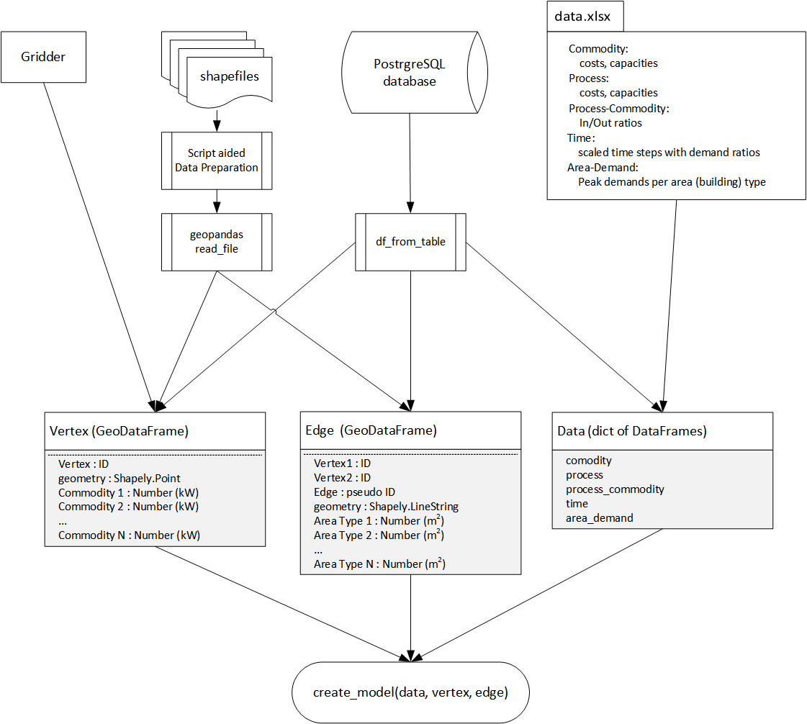

########################
Reference - Data Formats
########################

.. _a_datafromats:

As rivus expects its input variables from different sources, this section shall help you to get along with the parameters.

    Input sources and their data-flow until the main variables. (Vertex, Edge, Data)

.. _a_spreadsheet:

*************
Non Spatial
*************

You can retrieve non-spatial data from a spreadsheet or from a database.
As the spreadsheet was is the standard data input format, we will discuss that in the following section.
You can find examples (templates) in the :file:`/data/haag15/` or :file:`/data/mnl/` data folders.

This summary of the columns shall ease your understanding of those input variables.
(Extracted from the tool-tip info in the haag15 project.)

.. note::

    + If a cell does not have meaningful value in the record, that should be marked with the ``=N/A`` formula. Not empty cell.
    + Names of the sheets and columns must be preserved, as they are hard-coded into the parser.
    + Do not forget to check the unit of your inputs!
    + Do not leave 'zombie' record (e.g. a process without listed commodity).

Commodity
==========
cost-inv-fix
    Fixed investment costs [€/m]
    Capacity-independent investment costs for pipe/cable to transmit that commodity.   

cost-inv-var
    Variable invest costs [€/kW/m]
    Capacity-dependent investment costs for transmission capacity of a commodity from one vertex to another.   

cost-fix
    Variable fixed costs [€/kW/m]
    Capacity-dependent fixed costs for maintaining transmission capacity.  

cost-var
    Purchase costs [€/kWh]
    Cost for buying that commodity at source vertices, if any exist in the vertex_shapefile.   

loss-fix
    Fixed loss fraction [kW/m]
    Powerflow-independent loss of energy per meter of transmission length through the network. The fixed loss is calculated by (length * loss-fix).

loss-var
    Variable power loss [1/kW/m]
    Relative loss term, dependent on input power flow through a "pipe":
    Ingoing power flow per edge is multiplied by (1 - length * loss-var)

cap-max
    Maximum capacity [kW]
    Maximum possible transmission capacity per edge.

allowed-max
    Maximum allowed generation
    Limits the net amount of generation of this commodity (e.g. CO2). Note that processes that consume a commodity (e.g. CCS) can reduce the net amount.

Process
========

cost-inv-fix
    Fixed investment costs [€]

    Up-front investment for building a plant, independent of size.
    Has value zero mainly for small-scale technologies.

cost-inv-var
    Specific investment costs [€/kW]

    Size-dependent part for building a plant.

cost-fix
    Specific fixed costs [€/kW]

    Size-dependent part for maintaining a plant.

cost-var
    Variable costs [€/kWh]

    Operational costs to produce one unit of output, excluding fuel costs. Has value zero e.g. for PV or wind turbines (or if no sources are available).

cap-min
    Minimum capacity [kW]

    Smallest size a plant is typically available in. Has value zero for domestic technologies.

cap-max
    Maximum capacity [kW]

    Biggest capacity a plant typically is available in.

Process-Commodity
==================

ratio
	Input/output ratio
    Flows in and out of processes, relative to 1 unit of throughput. For CO2, unit is kg/kWh (for example)

Time
=====

weight
	Time step weight [hours]
    Length of time step in hours. Sum of all weights == 8760

Elec
	Scaling factor Elec [1]
    Relative scaling factor of demand 'Elec' per time step. Interpret like y-values of a normalised annual load duration curve.    

Heat
	Scaling factor Heat [1]
    Relative scaling factor of demand 'Heat' per time step. Interpret like y-values of a normalised annual load duration curve.

Area-Demand
============

peak
	Building peak demand [kW/|m2|]
    Peak demand of building type (must be present in building_shapefile) normalised to building area. Annual demand is encoded in time step weights on sheet Time.

.. testsetup:: *

    from rivus.gridder.create_grid import create_square_grid
    from rivus.gridder.extend_grid import extend_edge_data
    from rivus.gridder.extend_grid import vert_init_commodities

.. _a_vertex:

*********
Vertex 
*********

The examples are given with the help of the Gridder sub-package, but the that depicts 
very well what you should see in a shapefile's attribute list. (Excluding the special geometry column of course.)

.. table:: Structure of the ``vertex`` input variable

+----------------------+---------------+-------------------------------------------------------------+---------------------------+---------------------------+
| Vertex               | geometry      | Commodity 1. - e.g.: Elec                                   | Commodity 2. - e.g.: Heat | Commodity 3.  - e.g.: Gas |
+*************==========+===============+=============================================================+===========================+===========================+
| Zero-based numbering | Shapely.Point | Amount of available commodity per vertex. 0 to large number | same                      | same                      |
+----------------------+---------------+-------------------------------------------------------------+---------------------------+---------------------------+

You can also check it out quickly:

.. testcode::

    vdf, edf = create_square_grid()
    extend_edge_data(edf)
    vert_init_commodities(vdf, ['Elec', 'Heat', 'Gas'],[('Elec', 0, 5000), ])
    print(vdf.head())

Should give you:

.. testoutput::

                                          geometry  Vertex  Elec  Heat  Gas
    0                    POINT (11.66842 48.26739)       0  5000     0    0
    1  POINT (11.66976700131334 48.26738999211108)       1     0     0    0
    2           POINT (11.66842 48.26828931656865)       2     0     0    0
    3  POINT (11.66976702494603 48.26828930867949)       3     0     0    0

.. _a_edge:

*********
Edge 
*********

The examples are given with the help of the Gridder sub-package, but the that depicts 
very well what you should see in a shapefile's attribute list. (Excluding the special geometry column of course.)

.. table:: Structure of the ``edgr`` input variable

+----------------------+------------------------+----------------------+--------------------+---------------------------------------+---------------------------------+----------------------------+
| Vertex1              | Vertex2                | Edge                 | geometry           | Area Type 1. - e.g.: residential      | Area Type 2. - e.g.: industrial | Area Type 3. - e.g.: other |
+======================+========================+======================+====================+=======================================+=================================+============================+
| Reference to one end | Reference to other end | Zero-based numbering | Shapely.LineString | Sum of area of type 1 along this edge | same                            | same                       |
+----------------------+------------------------+----------------------+--------------------+---------------------------------------+---------------------------------+----------------------------+

You can also check it out quickly:

.. testcode::

    vdf, edf = create_square_grid()
    extend_edge_data(edf)
    vert_init_commodities(vdf, ['Elec', 'Heat', 'Gas'])
    print(edf.head())

Should give you:

.. testoutput::

                                                geometry  Edge  Vertex1  Vertex2  \
    0  LINESTRING (11.66842 48.26739, 11.669767001313...     0        0        1   
    1  LINESTRING (11.66842 48.26828931656865, 11.669...     1        2        3   
    2  LINESTRING (11.66842 48.26739, 11.66842 48.268...     2        0        2   
    3  LINESTRING (11.66976700131334 48.2673899921110...     3        1        3   

       residential  
    0         1000  
    1         1000  
    2         1000  
    3         1000  